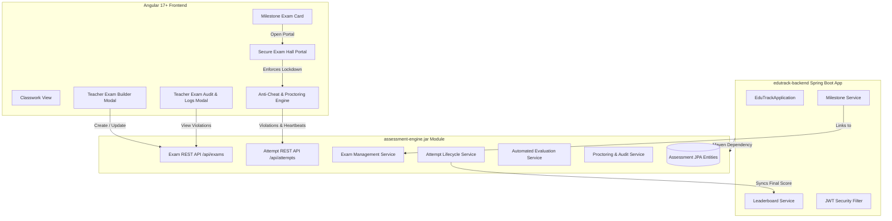
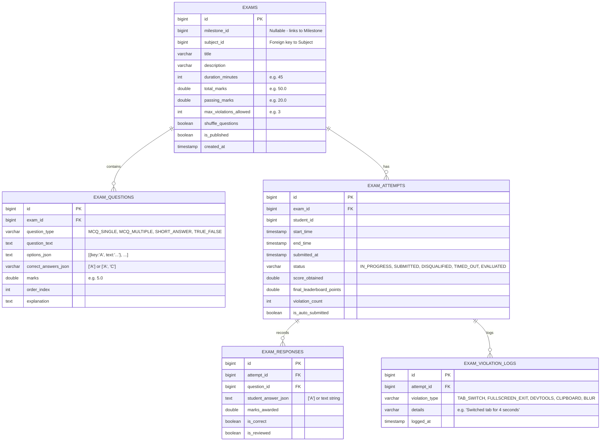

# Design & Implementation Plan: Modular Assessment Engine & Anti-Cheating Exam System

This technical specification details the architecture, module boundaries, data models, anti-cheating mechanisms, and integration plan for building a proctored **Test-Taking & Assessment System** into EduTrack.

As requested, the core assessment and anti-cheating engine will be built as an **independent, reusable library (`assessment-engine`) packaged as a separate `.jar` file**, which will be imported and consumed by `edutrack-backend`.

---

## 1. System Architecture & Modular Boundary Design

To ensure clean separation of concerns and maintainability, the application will follow a **modular library architecture**:



### Key Modular Design Principles
1. **Zero Tight Coupling**: `assessment-engine.jar` has its own isolated package namespace (`com.edutrack.assessment.*`).
2. **Pluggable & Standalone**: Can be packaged via `mvn clean package` as `assessment-engine-1.0.0.jar` and used in other educational projects without modification.
3. **Database Integration**: Utilizes JPA entities that share the parent application's datasource (`@EntityScan` and `@EnableJpaRepositories` registered via auto-configuration or component scanning).

---

## 2. Anti-Cheating & Browser-Lockdown Specification

The exam taking portal features a comprehensive, multi-tiered proctoring defense system to prevent academic dishonesty and AI assistance:

```mermaid
flowchart TD
    Start([Student Enters Exam]) --> FullscreenCheck{Request Fullscreen Granted?}
    FullscreenCheck -- No --> BlockStart[Block Exam Start]
    FullscreenCheck -- Yes --> InitMonitors[Initialize Anti-Cheat Monitors]

    InitMonitors --> M1[Fullscreen Change Listener]
    InitMonitors --> M2[Page Visibility & Blur Listener]
    InitMonitors --> M3[Clipboard & Context Menu Blocker]
    InitMonitors --> M4[Keyboard Shortcut Interceptor]
    InitMonitors --> M5[Server Heartbeat & Timer Sync]

    M1 -- User Exits Fullscreen --> TriggerStrike[Register Violation Strike]
    M2 -- User Switches Tab or Window --> TriggerStrike
    M3 -- Copy / Paste Attempt --> BlockAction[Block Event + Log Warning]
    M4 -- Alt+Tab / Ctrl+C / F12 --> BlockKey[Prevent Default + Log Warning]

    TriggerStrike --> ServerLog[POST /api/attempts/{id}/violation]
    ServerLog --> StrikeCheck{Strike Count >= Max Allowed?}
    StrikeCheck -- No --> ShowWarningModal[Display Warning Overlay with 10s Timer]
    StrikeCheck -- Yes --> AutoDisqualify[Auto-Submit as DISQUALIFIED & Lockout]
```

### Detailed Anti-Cheating Guard Layers

| Protection Layer | Technical Implementation | Action on Violation |
| :--- | :--- | :--- |
| **1. Fullscreen Lockdown** | HTML5 Fullscreen API (`document.documentElement.requestFullscreen()`). Monitored via `document.addEventListener('fullscreenchange')`. | Exiting fullscreen pauses answering, launches a high-priority warning modal with a 10s countdown to return, and increments the strike counter. |
| **2. Tab / App Switching** | `document.addEventListener('visibilitychange')` checking `document.visibilityState === 'hidden'`, plus `window.addEventListener('blur')`. | Tab switching or opening another desktop application triggers an immediate violation strike with timestamp and server audit log. |
| **3. AI & Web Copy-Paste Blocker** | `document.addEventListener('copy', e.preventDefault())`, `paste`, `cut`, `contextmenu` (right-click), `selectstart`. | Completely prevents students from copying question text into ChatGPT, Claude, Gemini, or search engines, and prevents pasting generated code/answers. |
| **4. Shortcut Interception** | `window.addEventListener('keydown')` intercepting `Alt+Tab`, `Ctrl+Tab`, `Ctrl+C`, `Ctrl+V`, `Ctrl+A`, `Ctrl+W`, `F12` (DevTools), `Ctrl+Shift+I`, `PrintScreen`. | Keyboard events are intercepted and suppressed (`e.preventDefault()`). |
| **5. DevTools & Window Resizing** | Monitored via `window.outerWidth - window.innerWidth` delta detection and debugger traps. | Opening developer tools or browser inspect mode registers a tampering violation strike. |
| **6. Server-Side Timer & Clock Tamper Resistance** | Remaining time is calculated and enforced on the backend from `startTime + durationMinutes`. A 15-second heartbeat ping continuously synchronizes with the server. | Local client machine clock changes have zero effect on exam duration. Submissions after deadline are rejected as `TIMED_OUT`. |
| **7. Strike Limit & Auto-Disqualification** | Teacher configures max allowed violation strikes (default: 3 strikes). | Once strikes exceed the limit, the test is **instantly locked, auto-submitted, marked `DISQUALIFIED` with 0 marks**, and the student is removed from the exam hall. |

---

## 3. Database Schema & Data Models (inside `assessment-engine.jar`)



---

## 4. Proposed Changes Across System Components

### Component 1: `assessment-engine` (New Standalone Maven Library JAR)

#### [NEW] `backend/assessment-engine/pom.xml`
- Standard Maven library configuration targeting Java 17.
- Dependencies: `spring-boot-starter-data-jpa`, `spring-boot-starter-web`, `spring-boot-starter-validation`, `jackson-databind`.
- Output: `edutrack-assessment-1.0.0.jar`.

#### [NEW] JPA Entities & Repositories (`com.edutrack.assessment.*`)
- `Exam.java`, `ExamQuestion.java`, `ExamAttempt.java`, `ExamResponse.java`, `ExamViolationLog.java`.
- `QuestionType.java` (`MCQ_SINGLE`, `MCQ_MULTIPLE`, `SHORT_ANSWER`, `TRUE_FALSE`).
- `AttemptStatus.java` (`IN_PROGRESS`, `SUBMITTED`, `EVALUATED`, `DISQUALIFIED`, `TIMED_OUT`).
- `ViolationType.java` (`TAB_SWITCH`, `FULLSCREEN_EXIT`, `DEVTOOLS_OPENED`, `CLIPBOARD_ACTION`, `WINDOW_BLUR`).
- Corresponding JPA repositories with optimized queries.

#### [NEW] Services & Auto-Evaluation
- `ExamService.java`: CRUD operations for exams, adding questions, linking to milestones, calculating max marks.
- `ExamAttemptService.java`: Start attempt, record student answers, calculate remaining time, auto-evaluate objective questions (MCQs/True-False), and compute final score.
- `ProctoringService.java`: Receive violation events, increment student strike count, audit logs, and trigger automatic disqualification when the strike limit is reached.

#### [NEW] REST Controllers & DTOs
- `ExamController.java` (`/api/exams/**`):
  - `POST /api/exams`: Create exam with questions.
  - `GET /api/exams/milestone/{milestoneId}`: Fetch exam for a milestone.
  - `GET /api/exams/{id}/audit`: Fetch all student attempts and timestamped violation audit trails for instructors.
- `ExamAttemptController.java` (`/api/exams/{examId}/attempts/**`):
  - `POST /start`: Begin proctored attempt (starts server timer).
  - `POST /heartbeat`: 15s ping verifying timer and student activity.
  - `POST /violation`: Log anti-cheat violation event.
  - `POST /save-answer`: Auto-save response for a specific question.
  - `POST /submit`: Finalize exam submission and trigger auto-grading.

---

### Component 2: `backend` (`edutrack-backend`)

#### [MODIFY] `backend/pom.xml`
- Add `<dependency>` on `com.edutrack:assessment-engine:1.0.0`.

#### [MODIFY] `backend/src/main/java/com/edutrack/model/Milestone.java`
- Add fields:
  ```java
  private String milestoneType = "ASSIGNMENT"; // "ASSIGNMENT" or "EXAM"
  private Long examId; // Optional reference to associated Exam
  ```

#### [MODIFY] `backend/src/main/java/com/edutrack/dto/MilestoneDto.java`
- Expose `milestoneType`, `examId`, `durationMinutes`, and `totalQuestions` in API payloads.

#### [MODIFY] `backend/src/main/java/com/edutrack/service/LeaderboardService.java`
- Include exam attempt scores in the normalized subject leaderboard formula:
  $$\text{Exam Points} = 100.0 \times \left(\frac{\text{Obtained Marks}}{\text{Exam Total Marks}}\right)$$

#### [MODIFY] `backend/src/main/java/com/edutrack/config/DataInitializer.java`
- Seed a demo proctored exam with 5 MCQ questions for testing.

---

### Component 3: `frontend-angular` (Angular UI & Anti-Cheat Environment)

#### [NEW] `frontend-angular/src/app/services/proctoring.service.ts`
- Encapsulates fullscreen lock, visibility change detection, clipboard suppression, shortcut blocking, violation counter, and warning modal state.

#### [NEW] `frontend-angular/src/app/components/exam/exam-hall.component.ts`, `.html`, `.css`
- **Distraction-Free Proctored Exam Portal**:
  - **Top Bar**: Live countdown timer, questions palette, violation strike indicator (`⚠️ Strikes: 1 / 3`).
  - **Question Area**: Clear single/multi-choice selection, code formatting, review status flag.
  - **Violation Overlay Modal**: Appears when student exits fullscreen or leaves tab with 10s countdown to return.
  - **Disqualification Screen**: Displays when maximum strikes are exceeded.
  - **Result Summary**: Instant score breakdown upon legitimate submission.

#### [NEW] `frontend-angular/src/app/components/modals/exam-builder-modal.component.ts`
- Teacher modal for building exams:
  - Add/edit questions, options, correct answers, and marks per question.
  - Set duration, passing criteria, and maximum allowed violation strikes.

#### [NEW] `frontend-angular/src/app/components/modals/exam-audit-modal.component.ts`
- Teacher modal to review student exam submissions with full timestamped proctoring violation logs.

#### [MODIFY] `frontend-angular/src/app/components/class-detail/classwork/classwork.component.html` & `.ts`
- For `milestone.milestoneType === 'EXAM'`, display an **Exam Milestone Card**:
  - Badge: `⏱️ Proctored Exam (45 mins)`
  - Action: `Take Exam` (for students) / `View Exam Submissions & Logs` (for teachers).
  - Status display: `Not Attempted`, `Submitted (42/50)`, or `Disqualified`.

---

## 5. Verification & Test Plan

### Step 1: Automated Compilation & Packaging
1. Compile `assessment-engine`:
   ```powershell
   mvn -f backend/assessment-engine/pom.xml clean install
   ```
2. Compile and package main Spring Boot application:
   ```powershell
   mvn -f backend/pom.xml clean package -DskipTests
   ```
3. Compile Angular frontend:
   ```powershell
   npx --prefix frontend-angular ng build --configuration production
   ```

### Step 2: Manual Anti-Cheating & Exam Flow Verification
1. **Teacher Creates Exam**:
   - Log in as Instructor -> Click "Create Milestone" -> Select "Proctored Exam".
   - Add 3 MCQ questions, set 15-minute duration, and max violations = 2.
2. **Student Enters Exam**:
   - Log in as Student -> Locate the Exam Milestone card -> Click "Start Exam".
   - Confirm full-screen prompt is displayed and accepted.
3. **Anti-Cheat Verification**:
   - **Tab Switch**: Switch to another tab and switch back -> Verify strike 1 alert is shown with log.
   - **Copy-Paste Block**: Try to select question text or right-click -> Verify selection and copy are blocked.
   - **Shortcut Interception**: Press `Ctrl+C` or `Alt+Tab` -> Verify action is blocked.
   - **Disqualification Trigger**: Exit fullscreen for the 2nd time -> Verify exam auto-submits with status `DISQUALIFIED`.
4. **Teacher Audit Review**:
   - Log in as Instructor -> Open Exam Submissions -> Confirm disqualified student attempt shows timestamped logs for tab switch and fullscreen exit.
   - Confirm valid student scores map to the subject leaderboard.
