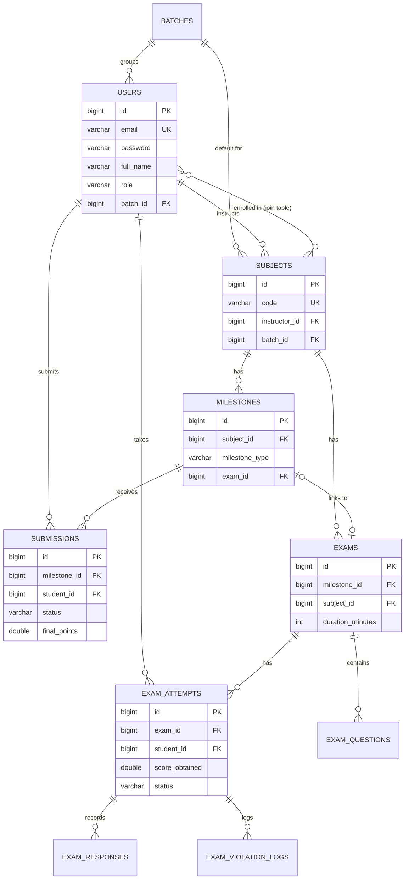

# Database Architecture & Migration Plan

This document outlines the strategy for moving the EduTrack system from its initial volatile in-memory storage to a production-ready, persistent relational database. It serves as a blueprint for the tables involved, relationships, and the technical approach for implementing a robust database layer.

---

## 1. Migration Strategy: H2 to PostgreSQL
Currently, the system uses an in-memory **H2 database** (as configured in the `dev` profile of `application.yml`). While excellent for rapid prototyping and testing, it lacks persistence across server restarts. 

**The Approach:**
- **Target Engine:** **PostgreSQL** is chosen for its robustness, JSON support (useful for storing exam options and unstructured deliverables), and standard compliance. The `postgres` profile is already scaffolded in `application.yml`.
- **ORM / JPA:** The application will continue to use Spring Data JPA & Hibernate. This provides a database-agnostic abstraction layer, meaning the Java code (Entities and Repositories) requires minimal to zero changes.
- **Schema Management:** Instead of relying on Hibernate's `ddl-auto=update` in production, we will integrate **Flyway** or **Liquibase** for strict version-controlled database migrations in the future.
- **Connection Pooling:** The system will leverage HikariCP (Spring's default) to maintain an efficient pool of database connections, crucial during high-load events like synchronous exam submissions.

---

## 2. Core Tables and Entities

Based on the SRS, API documentation, and the Modular Assessment Engine plan, the database is divided into two logical schemas/modules.

### 2.1 EduTrack Core Tables
These tables handle users, academic groupings, and standard PBL assignments.

- **`users`**: Central authentication table for all roles (Students, Instructors, Admins). Stores credentials, role enums, and profile data.
- **`batches`**: Cohorts that group students together for a given academic year.
- **`subjects`**: Represents the lab courses. Managed by instructors and associated with a default batch.
- **`subject_enrolled_students`**: A many-to-many join table bridging `users` (students) and `subjects` for explicit manual enrollments.
- **`milestones`**: Sequential deliverables created by faculty. Can represent standard assignments or link to proctored exams.
- **`submissions`**: Student uploads, links, and text submitted against a milestone. Evaluated by instructors with points and timeliness multipliers.

### 2.2 Assessment & Anti-Cheat Engine Tables
These tables belong to the decoupled `assessment-engine.jar` and handle objective testing and proctoring.

- **`exams`**: Defines the exam rules, duration, and passing criteria. Linked to a specific milestone and subject.
- **`exam_questions`**: Holds the individual questions, utilizing JSON text fields for options to allow flexible data structures.
- **`exam_attempts`**: Records a student's session taking an exam, tracking timestamps, final scores, and completion status.
- **`exam_responses`**: Individual answers submitted by a student per question.
- **`exam_violation_logs`**: Audit trails logging any cheating attempts (e.g., tab switches, fullscreen exits) caught by the frontend proctoring service.

---

## 3. Entity Relationship Diagram (ERD)

The following diagram visualizes the foreign-key constraints and cardinality across the entire platform:

---

## 4. Implementation Next Steps

1. **Local Postgres Setup:** Ensure PostgreSQL is installed locally or via Docker Compose. Create the target `edutrackdb` database.
2. **Profile Switch:** Change the active profile in `application.yml` from `dev` to `postgres`. Update the file with the appropriate local datasource credentials.
3. **Dependency Check:** Verify the `postgresql` driver dependency exists in `backend/pom.xml`.
4. **Entity Validation:** Start the application with `spring.jpa.hibernate.ddl-auto=update` to have Hibernate map the existing Entity classes into physical Postgres tables automatically.
5. **Data Seeding script:** (Optional) Transition the programmatic `DataInitializer.java` configuration to standard `schema.sql` and `data.sql` scripts for deterministic environment recreation.
