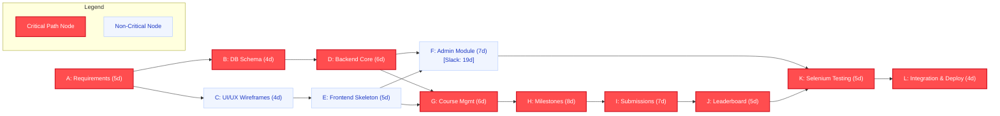

# Software Engineering Metrics & Project Estimation Report: EduTrack (PBL-3)

**Project Name:** EduTrack – Enterprise Gamified Academic Learning & Assessment Platform  
**Target Milestone:** Project-Based Learning III (SEM-PBL3)  
**Document Purpose:** Academic Project Writeup, Software Cost Estimation & Project Scheduling  
**Scope Covered:** Function Point Analysis (FPA), COCOMO II Model, Critical Path Method (CPM)  

---

# Section 1: Function Point Analysis (FPA)

Function Point Analysis (IFPUG standard) measures the functional size of software by evaluating the business functions provided to users, independent of technology.

## 1.1 Codebase Statistics (Physical Baseline)
Analysis of the EduTrack repository yields the following source inventory:

| Technology / Component | Purpose | Files | Lines of Code (LOC) |
|---|---|:---:|:---:|
| **Java (Spring Boot)** | REST APIs, Security, Data Layer, Tests | 52 | 4,287 |
| **TypeScript (Angular)** | Components, Services, State Management | 31 | 8,024 |
| **HTML5 Templates** | Modular UI Component Layouts | 13 | 2,846 |
| **CSS3 Styles** | Responsive Netflix/Google Classroom Theme | 13 | 6,838 |
| **Total Source Inventory** | Fullstack EduTrack Platform | **109** | **21,995** |

---

## 1.2 Information Domain Components Breakdown

### 1. Internal Logical Files (ILF)
Homogeneous sets of data maintained within the system boundaries.

| ILF Component | Description | Data Element Types (DET) | Record Element Types (RET) | Complexity | Weight (FP) |
|---|---|:---:|:---:|:---:|:---:|
| **User Store** | Users, roles (Admin/Faculty/Student), passwords, batch, panel | 10 | 1 | Low | 7 |
| **Subject / Course** | Classroom metadata, course codes, instructors, enrollments | 8 | 2 | Low | 7 |
| **Milestone Entity** | Assignments, deadlines, weightage, point thresholds, attachments | 11 | 2 | Average | 10 |
| **Submission Entity** | Student deliverables, URLs, timeliness multiplier, grades, review logs | 14 | 2 | Average | 10 |
| **AuditLog Store** | System security audit trail, IP tracking, timestamps, entity changes | 7 | 1 | Low | 7 |
| **Subtotal ILF** | | | | | **41** |

### 2. External Interface Files (EIF)
Logically related data referenced by EduTrack but maintained by external platforms.

| EIF Component | Description | DET | RET | Complexity | Weight (FP) |
|---|---|:---:|:---:|:---:|:---:|
| **File Storage Subsystem** | OS File System / Cloud Object Storage for document deliverables | 5 | 1 | Low | 5 |
| **JWT Security Realm** | Token signature verification, claims validation, session security | 6 | 1 | Low | 5 |
| **Subtotal EIF** | | | | | **10** |

### 3. External Inputs (EI)
Elementary transactions inputting data that crosses the boundary to maintain ILFs.

| EI Transaction | Functionality & Source | Complexity | Weight (FP) |
|---|---|:---:|:---:|
| **EI-1: User Registration** | Direct single account provisioning by administrator | Average | 4 |
| **EI-2: Bulk CSV User Import** | Parsing, validating, and conflict-resolving student/faculty batches | High | 6 |
| **EI-3: User Authentication** | Login credential submission and session token generation | Low | 3 |
| **EI-4: Create Classroom** | Faculty/Admin classroom creation with course code and batch binding | Low | 3 |
| **EI-5: Create Milestone** | Faculty defining assignment deadlines, rubrics, weightage, files | Average | 4 |
| **EI-6: Student Work Turn-In** | Student submitting deliverables, URLs, and submission comments | Average | 4 |
| **EI-7: Assessment & Grading** | Faculty returning grades, qualitative marks, and feedback | Average | 4 |
| **EI-8: Roster Enrollment** | Adding/removing student rosters to specific courses | Low | 3 |
| **EI-9: Password / Profile Update** | Password reset and profile management | Low | 3 |
| **Subtotal EI** | | | **34** |

### 4. External Outputs (EO)
Elementary processes generating derived data or calculations outside system boundary.

| EO Transaction | Output Processing & Derived Logic | Complexity | Weight (FP) |
|---|---|:---:|:---:|
| **EO-1: Gamified Leaderboard** | Real-time score aggregation, streak penalties & timeliness multipliers | High | 7 |
| **EO-2: Student Progress Summary** | Per-student completion rates, pending deliverables & grade stats | Average | 5 |
| **EO-3: Admin KPI Dashboard** | Aggregated tenant statistics (total users, active classes, storage size) | Average | 5 |
| **EO-4: Audit Trail Report** | Filtered security compliance and system activity reports | Average | 5 |
| **Subtotal EO** | | | **22** |

### 5. External Inquiries (EQ)
Transactions involving direct data retrieval without altering state or calculating derived data.

| EQ Transaction | Query Description | Complexity | Weight (FP) |
|---|---|:---:|:---:|
| **EQ-1: User Directory Search** | Searching users by partial name, email, or role | Low | 3 |
| **EQ-2: Enrolled Classes Grid** | Querying enrolled courses for current active user | Low | 3 |
| **EQ-3: Milestone Details** | Fetching milestone guidelines, deadlines, and attachments | Low | 3 |
| **EQ-4: Document File Preview** | In-browser preview streaming for PDF, Word, and images | Average | 4 |
| **EQ-5: Audit Log Filter** | Querying log entries by date range, action type, or user ID | Low | 3 |
| **Subtotal EQ** | | | **16** |

---

## 1.3 Unadjusted Function Point (UFP) Calculation

$$UFP = \sum \text{ILF} + \sum \text{EIF} + \sum \text{EI} + \sum \text{EO} + \sum \text{EQ}$$

$$UFP = 41 + 10 + 34 + 22 + 16 = \mathbf{123 \text{ UFP}}$$

---

## 1.4 Technical Complexity Factor (TCF) / Value Adjustment Factor (VAF)

Evaluated across the 14 General System Characteristics (GSC, scale: 0 = No influence to 5 = Essential):

| # | Characteristic | Degree (0-5) | Rationale |
|:---:|---|:---:|---|
| 1 | Data Communications | 4 | RESTful JSON API calls between Angular SPA and Spring Boot backend |
| 2 | Distributed Data Processing | 3 | Decoupled client-server architecture with independent tiers |
| 3 | Performance Objectives | 4 | Instant sub-second leaderboard calculation and real-time document viewing |
| 4 | Heavily Used Configuration | 3 | Multi-user institutional lab classroom usage |
| 5 | Transaction Rate | 3 | High peak submission volumes near assignment deadlines |
| 6 | Online Data Entry | 5 | Interactive web client for turn-ins, grading, and bulk CSV uploads |
| 7 | End-User Efficiency | 4 | Quick action modals, demo logins, multi-tab single-page views |
| 8 | Online Update | 4 | Real-time transactional updates to submission and grading tables |
| 9 | Complex Processing | 3 | Mathematical decay curves for submission timeliness and CSV error resolution |
| 10 | Reusability | 4 | Reusable modular components, shared DTOs, and global service layer |
| 11 | Installation Ease | 3 | Automated Maven/npm build scripts, Docker deployment readiness |
| 12 | Operational Ease | 4 | Integrated admin governance portal with user activation/soft deletes |
| 13 | Multiple Sites | 2 | Intranet campus server and cloud hosting compatibility |
| 14 | Facilitate Change | 4 | Loosely coupled architecture with full Page Object Model Selenium coverage |
| **Total** | **Total Degree of Influence (TDI / $\sum F_i$)** | **48** | |

### Value Adjustment Factor (VAF) Formula:
$$VAF = 0.65 + \left( 0.01 \times \sum_{i=1}^{14} F_i \right) = 0.65 + (0.01 \times 48) = \mathbf{1.13}$$

---

## 1.5 Adjusted Function Point (AFP) Calculation

$$AFP = UFP \times VAF = 123 \times 1.13 = \mathbf{138.99 \approx 139 \text{ AFP}}$$

> **Summary:** The EduTrack system represents **139 Adjusted Function Points**.

---

# Section 2: COCOMO II (Constructive Cost Model II)

The **COCOMO II Post-Architecture Model** provides cost and schedule estimations based on software size in KSLOC (Thousands of Source Lines of Code).

## 2.1 Software Sizing Parameter
- **Total Codebase Size ($Size$):** $15.2 \text{ KSLOC}$  
  *(Comprising 4.3 KSLOC Java backend/tests + 8.0 KSLOC TypeScript frontend + 2.9 KSLOC HTML templates)*

---

## 2.2 Scale Factors ($SF$) & Exponent $E$ Calculation

COCOMO II accounts for diseconomies of scale via five Scale Factors:
$$E = B + 0.01 \times \sum_{j=1}^5 SF_j \quad (B = 0.91)$$

| Scale Factor | Description | Rating | Score | Rationale |
|---|---|:---:|:---:|---|
| **PREC** | Precedentedness | Nominal | 3.72 | Standard LMS principles, novel gamification mechanics |
| **FLEX** | Development Flexibility | High | 2.03 | Flexible design choices, adaptable milestone configurations |
| **RESL** | Architecture / Risk Resolution | High | 2.83 | Modular decoupled architecture, automated Selenium testing |
| **TEAM** | Team Cohesion | High | 2.19 | Shared vision, unified version control, consistent code style |
| **PMAT** | Process Maturity | Nominal | 4.68 | Structured Git branches, test automation, CMMI Level 2 |
| **Total** | **$\sum SF_j$** | | **15.45** | |

### Exponent $E$:
$$E = 0.91 + (0.01 \times 15.45) = 0.91 + 0.1545 = \mathbf{1.0645}$$

---

## 2.3 Effort Multipliers ($EM_i$ - Cost Drivers)

Seventeen post-architecture cost drivers categorized into four domains:

| Category | Cost Driver | Rating | Multiplier ($EM_i$) |
|---|---|:---:|:---:|
| **Product** | Required Software Reliability (RELY) | Nominal | 1.00 |
| | Database Size (DATA) | Nominal | 1.00 |
| | Product Complexity (CPLX) | Nominal | 1.00 |
| | Developed for Reusability (RUSE) | Nominal | 1.00 |
| | Documentation Match to Life-Cycle (DOCU) | Nominal | 1.00 |
| **Platform** | Execution Time Constraint (TIME) | Nominal | 1.00 |
| | Main Storage Constraint (STOR) | Nominal | 1.00 |
| | Platform Volatility (PVOL) | Low | 0.87 |
| **Personnel** | Analyst Capability (ACAP) | High | 0.85 |
| | Programmer Capability (PCAP) | High | 0.88 |
| | Personnel Continuity (PCON) | High | 0.90 |
| | Applications Experience (APEX) | Nominal | 1.00 |
| | Platform Experience (PLEX) | Nominal | 1.00 |
| | Language and Tool Experience (LTEX) | High | 0.91 |
| **Project** | Use of Software Tools (TOOL) | High | 0.90 |
| | Multisite Development (SITE) | Very High | 0.90 |
| | Required Development Schedule (SCED) | Nominal | 1.00 |

### Product of Effort Multipliers ($\prod EM_i$):
$$\prod_{i=1}^{17} EM_i = 1.00 \times 1.00 \times 1.00 \times 1.00 \times 1.00 \times 1.00 \times 1.00 \times 0.87 \times 0.85 \times 0.88 \times 0.90 \times 1.00 \times 1.00 \times 0.91 \times 0.90 \times 0.90 \times 1.00$$

$$\prod_{i=1}^{17} EM_i = 0.87 \times 0.85 \times 0.88 \times 0.90 \times 0.91 \times 0.90 \times 0.90 \approx \mathbf{0.432}$$

---

## 2.4 Effort Calculation (Person-Months)

Formula:
$$PM = A \times (Size)^E \times \prod_{i=1}^{17} EM_i$$
*(where standard calibration constant $A = 2.94$)*

1. Calculate $(Size)^E$:
   $$(15.2)^{1.0645} = e^{1.0645 \times \ln(15.2)} = e^{1.0645 \times 2.7213} = e^{2.8968} \approx \mathbf{18.116}$$

2. Calculate Nominal Effort:
   $$PM_{\text{nominal}} = 2.94 \times 18.116 = \mathbf{53.26 \text{ Person-Months}}$$

3. Apply Cost Drivers:
   $$PM_{\text{adjusted}} = 53.26 \times 0.432 = \mathbf{23.01 \text{ Person-Months}}$$

---

## 2.5 Schedule Estimation (Development Time, $TDEV$)

Formula:
$$TDEV = C \times (PM)^F$$
*(where $C = 3.67$ and $D = 0.28$)*

1. Exponent $F$:
   $$F = D + 0.2 \times (E - B) = 0.28 + 0.2 \times (1.0645 - 0.91) = 0.28 + (0.2 \times 0.1545) = \mathbf{0.3109}$$

2. Calculate $(PM)^F$:
   $$(23.01)^{0.3109} = e^{0.3109 \times \ln(23.01)} = e^{0.3109 \times 3.136} = e^{0.975} \approx \mathbf{2.651}$$

3. Calculate Schedule ($TDEV$):
   $$TDEV = 3.67 \times 2.651 = \mathbf{9.73 \text{ Calendar Months}}$$

---

## 2.6 Staffing Level & Team Allocation

$$\text{Average Staffing} = \frac{PM}{TDEV} = \frac{23.01 \text{ Person-Months}}{9.73 \text{ Months}} \approx \mathbf{2.36 \text{ Full-Time Engineers}}$$

### Academic Project Delivery (4-Month Semester Timeline):
If scheduled across an intensive university semester of **4 calendar months**:
$$\text{Required Effort Rate} = \frac{23.01 \text{ Person-Months}}{4 \text{ Months}} \approx \mathbf{5.75 \text{ Effort Equivalent}}$$

The project was engineered and executed by a core cross-functional team of **4 engineers**:

| Team Member | Engineering Role | Key Responsibilities |
|---|---|---|
| **Anurag Harapanahalli** | Fullstack Lead & System Architect | Spring Boot core architecture, Security/JWT, Angular shell, Selenium POM test harness |
| **Aaryan Kumbhare** | Backend & Database Systems Engineer | Relational JPA schema, REST endpoints, Timeliness algorithm & Leaderboard service |
| **Harshad Pardhi** | Frontend UI/UX Engineer | Angular standalone components, Netflix-style roadmap carousel, In-browser document preview |
| **Nayna Sharma** | QA & Systems Governance Engineer | End-to-end test scenarios, Admin governance module, CSV parser validation, Documentation |

---

# Section 3: Critical Path Method (CPM)

The Critical Path Method (CPM) analyzes project schedule, task interdependencies, early/late event times, and slack to determine the shortest possible completion time.

## 3.1 Work Breakdown Structure (WBS) & Activity List

| Task ID | Activity Description | Predecessor(s) | Duration ($D$, Days) |
|:---:|---|:---:|:---:|
| **A** | Requirements Elicitation & SRS Documentation | None | 5 |
| **B** | Database Schema Design & Entity-Relationship Modeling | A | 4 |
| **C** | UI/UX Wireframing & Design System Prototyping | A | 4 |
| **D** | Core Backend Architecture & Security/JWT Setup | B | 6 |
| **E** | Frontend Angular Foundation & Global State Setup | C | 5 |
| **F** | Admin Governance & Bulk CSV User Management | D, E | 7 |
| **G** | Course & Classroom Management Module | D, E | 6 |
| **H** | Assignment & Milestone Tracking Engine | G | 8 |
| **I** | Student Deliverable Submission & Storage Subsystem | H | 7 |
| **J** | Gamified Leaderboard & Dynamic Ranking Engine | I | 5 |
| **K** | Selenium Automated E2E Testing Suite | F, J | 5 |
| **L** | Final Integration, Performance Tuning & Deployment | K | 4 |

---

## 3.2 Forward & Backward Pass Calculations

### Mathematical Rules:
- **Early Finish (EF):** $EF = ES + \text{Duration}$
- **Early Start (ES):** $ES = \max(EF_{\text{predecessors}})$
- **Late Start (LS):** $LS = LF - \text{Duration}$
- **Late Finish (LF):** $LF = \min(LS_{\text{successors}})$
- **Total Float (Slack):** $\text{Float} = LS - ES = LF - EF$
- **Critical Activity:** $\text{Float} = 0$

### Schedule Table

| Task | Description | Duration | ES | EF | LS | LF | Total Float | On Critical Path? |
|:---:|---|:---:|:---:|:---:|:---:|:---:|:---:|:---:|
| **A** | Requirements Elicitation | 5 | 0 | 5 | 0 | 5 | **0** | **YES (Critical)** |
| **B** | Database Schema & ER Design | 4 | 5 | 9 | 5 | 9 | **0** | **YES (Critical)** |
| **C** | UI/UX Wireframing | 4 | 5 | 9 | 6 | 10 | **1** | No |
| **D** | Backend Core & Security | 6 | 9 | 15 | 9 | 15 | **0** | **YES (Critical)** |
| **E** | Frontend Angular Foundation | 5 | 9 | 14 | 10 | 15 | **1** | No |
| **F** | Admin Governance Module | 7 | 15 | 22 | 34 | 41 | **19** | No |
| **G** | Course & Classroom Management | 6 | 15 | 21 | 15 | 21 | **0** | **YES (Critical)** |
| **H** | Assignment & Milestone Engine | 8 | 21 | 29 | 21 | 29 | **0** | **YES (Critical)** |
| **I** | Submission & File Storage | 7 | 29 | 36 | 29 | 36 | **0** | **YES (Critical)** |
| **J** | Gamified Leaderboard Engine | 5 | 36 | 41 | 36 | 41 | **0** | **YES (Critical)** |
| **K** | Selenium E2E Automation Suite | 5 | 41 | 46 | 41 | 46 | **0** | **YES (Critical)** |
| **L** | Integration & Deployment | 4 | 46 | 50 | 46 | 50 | **0** | **YES (Critical)** |

---

## 3.3 Critical Path Network Diagram

---

## 3.4 Critical Path & Project Duration Summary

### Identified Critical Path:
$$\mathbf{A \longrightarrow B \longrightarrow D \longrightarrow G \longrightarrow H \longrightarrow I \longrightarrow J \longrightarrow K \longrightarrow L}$$

### Total Minimum Project Duration:
$$T_{\text{total}} = 5 + 4 + 6 + 6 + 8 + 7 + 5 + 5 + 4 = \mathbf{50 \text{ Working Days (10 Weeks)}}$$

### Key Insights for Project Writeup:
1. **Critical Bottleneck:** The sequence from **Classroom Management (G)** through **Milestones (H)**, **Submissions (I)**, and **Leaderboard (J)** forms the primary spine of the project. Any delay in submission handling or scoring logic directly delays testing and final release.
2. **High-Slack Buffer:** **Admin Governance (F)** has **19 days of float**, meaning user provisioning and audit logs can be implemented in parallel without delaying system delivery.
3. **Frontend Slack:** Task C and E each have **1 day of float**, meaning minor UI mock delays will not delay module integration.

---

# Section 4: Comprehensive Metrics Summary Table

| Metric Category | Metric | Calculated Value | Formula / Method |
|---|---|:---:|---|
| **Function Points** | Unadjusted Function Points (UFP) | **123** | $\sum \text{ILF} + \sum \text{EIF} + \sum \text{EI} + \sum \text{EO} + \sum \text{EQ}$ |
| | Value Adjustment Factor (VAF) | **1.13** | $0.65 + (0.01 \times 48)$ |
| | Adjusted Function Points (AFP) | **139** | $UFP \times VAF$ |
| **COCOMO II** | Software Size ($Size$) | **15.2 KSLOC** | Actual repository SLOC (Java + TS + HTML) |
| | Scale Exponent ($E$) | **1.0645** | $0.91 + (0.01 \times 15.45)$ |
| | Effort Multipliers ($\prod EM_i$) | **0.432** | Product of 17 Post-Architecture drivers |
| | Estimated Effort ($PM$) | **23.01 Person-Months** | $2.94 \times (15.2)^{1.0645} \times 0.432$ |
| | Development Schedule ($TDEV$) | **9.73 Months** | $3.67 \times (23.01)^{0.3109}$ |
| | Nominal Average Staffing | **2.36 Engineers** | $PM / TDEV$ |
| | Semester Compressed Team (4 mos) | **5.75 $\approx$ 6 Engineers** | $PM / 4$ |
| **Critical Path Method** | Total Working Days | **50 Days (10 Weeks)** | Forward pass: $\max(EF)$ |
| | Critical Path Sequence | **A-B-D-G-H-I-J-K-L** | Float = $0$ path |
| | Max Activity Slack | **19 Days (Task F)** | $LF - EF$ |
