# 🎓 EduTrack: Enterprise Gamified Milestone & Assessment Platform
### *Project-Based Learning III (SEM-PBL3) — Comprehensive Project Dossier & Technical Specification*

> **Project Team Members:**  
> 👨‍💻 **Anurag Harapanahalli** &nbsp;|&nbsp; 👨‍💻 **Aaryan Kumbhare** &nbsp;|&nbsp; 👨‍💻 **Harshad Pardhi** &nbsp;|&nbsp; 👩‍💻 **Nayna Sharma**  
> *Department of Computer Science & Engineering*

[](https://www.oracle.com/java/)
[](https://spring.io/projects/spring-boot)
[](https://angular.io/)
[](https://www.typescriptlang.org/)
[](https://www.selenium.dev/)
[](https://junit.org/junit5/)
[](http://localhost:8080/swagger-ui/index.html)
[](LICENSE)

---

## 📌 Table of Contents
1. [Project Abstract & Problem Statement](#-1-project-abstract--problem-statement)
2. [Key System Features & Capabilities](#-2-key-system-features--capabilities)
3. [Software Development Life Cycle (SDLC): Agile Methodology](#-3-software-development-life-cycle-sdlc-agile-methodology)
4. [Structured Systems Analysis & Design (SSAD)](#-4-structured-systems-analysis--design-ssad)
   - [Data Flow Diagram (DFD Level 0 — Context Diagram)](#41-dfd-level-0--context-diagram)
   - [Data Flow Diagram (DFD Level 1 — Detailed System Flow)](#42-dfd-level-1--detailed-subsystem-data-flow)
   - [Entity-Relationship Diagram (ERD)](#43-entity-relationship-diagram-erd)
   - [Data Dictionary](#44-data-dictionary)
5. [Object-Oriented Analysis & Design (OOAD)](#-5-object-oriented-analysis--design-ooad)
   - [Use Case Diagram](#51-use-case-diagram)
   - [Class Diagram](#52-system-class-diagram)
   - [Sequence Diagrams](#53-sequence-diagrams)
   - [State Machine Diagram](#54-submission-lifecycle-state-machine)
6. [Software Cost Estimation & Metrics](#-6-software-cost-estimation--metrics)
   - [Function Point Analysis (FPA)](#61-function-point-analysis-fpa---ifpug-standard)
   - [COCOMO II Cost Estimation Model](#62-cocomo-ii-post-architecture-model)
   - [Critical Path Method (CPM) & Schedule Analysis](#63-critical-path-method-cpm)
   - [PERT Estimation & Completion Probability](#64-pert-program-evaluation--review-technique-analysis)
7. [Quality Assurance & Selenium 4 Automated Testing](#-7-quality-assurance--selenium-4-automated-testing)
   - [Page Object Model (POM) Architecture](#71-page-object-model-pom-architecture)
   - [Automated E2E Test Suite Matrix (14 Tests)](#72-automated-e2e-test-suite-matrix)
   - [Test Execution Guide (Visual & Headless)](#73-running-the-automated-tests)
8. [System Architecture & Technology Stack](#-8-system-architecture--technology-stack)
9. [Installation, Setup & Execution Guide](#-9-installation-setup--execution-guide)
10. [Repository Structure](#-10-repository-structure)

---

# 📖 1. Project Abstract & Problem Statement

### 1.1 Context
In contemporary engineering and computing curricula, **Project-Based Learning (PBL)** constitutes the core pedagogic mechanism for cultivating practical engineering competencies. However, conventional institutional workflows suffer from:
1. **Fragmented Submission Channels**: Students submit across disconnected media (emails, shared drives, ad-hoc chat groups), causing lost submissions and broken audit trails.
2. **Opaque Assessment & Delayed Feedback**: Instructors struggle with manual version tracking, rubric inconsistency, and grading bottlenecks.
3. **Diminished Student Engagement**: Lack of real-time visibility into milestone deadlines, project progress, and competitive benchmarking leads to chronic procrastination and last-minute deliverables.

### 1.2 The EduTrack Solution
**EduTrack** is an enterprise-grade, fullstack web platform engineered to streamline end-to-end PBL laboratory administration. It unites:
- **Gamified Milestone Progressions**: Visual horizontal roadmap carousels (Netflix/Classroom hybrid) with real-time percentage completion and milestone status tags.
- **Dynamic Assessment Engine**: Rubric-based 1–5 star quality scoring combined with mathematical **timeliness multipliers** ($\ge 24\text{h early} = 1.2\times$, $\text{on-time} = 1.0\times$, $\text{late} = 0.5\times$).
- **Real-Time Gamified Leaderboards**: Automated point aggregation, competitive class ranking, and streak recognition.
- **In-Browser Universal Document Preview**: Real-time rendering of student deliverables including PDF, Microsoft Word (`.docx`), images, and code repositories without external software.
- **Enterprise Governance**: Administrator controls for single/bulk CSV user provisioning with smart column detection, conflict resolution, soft-deletes, and immutable security audit logs.

---

# 🚀 2. Key System Features & Capabilities

### 👨‍🎓 For Students
- **Interactive Course Dashboard**: View enrolled PBL labs, instructor details, syllabus codes, and overall completion percentages.
- **Milestone Roadmap**: Visual progress timeline with deliverable prerequisites, deadline countdowns, weightages, and downloadable instructor resources.
- **Turn-In Subsystem**: Drag-and-drop file uploads (PDF, ZIP, DOCX, Code) accompanied by Git repository links and private submission notes.
- **Real-Time Leaderboard**: Live competitive ranking reflecting calculated points, timeliness bonuses, and evaluator feedback.

### 👨‍🏫 For Instructors / Faculty
- **Course Classroom Studio**: Create and configure lab classrooms, assign designated student batches (e.g., A1, A2, B1), and manage rosters.
- **Milestone Authoring**: Define sequential deliverables, submission deadlines, total points, grading criteria, and reference starter templates.
- **Roster Evaluation Interface**: Grid-based grading console displaying student deliverables, submission timestamps, and timeliness tags.
- **Inline Multi-Format Document Preview**: Directly view and review Word documents and PDFs within modal dialogs without downloading.
- **1–5 Star Quality Rating & Feedback**: Return qualitative stars, numerical marks, and personalized written feedback. Points lock automatically upon approval.

### 🛠️ For System Administrators
- **Tenant Management**: Real-time KPI widgets tracking registered students, faculty, active courses, and audit entries.
- **Bulk CSV Onboarding with Conflict Resolution**: Fast multi-account import supporting flexible CSV headers, instant validation, duplicate email detection, and inline resolution modals.
- **Soft-Delete & Reactivation**: Deactivate departing users while preserving historical submission integrity and grading trails.
- **Security Audit Logs**: Comprehensive logging capturing IP addresses, timestamps, actions, and altered entities for regulatory compliance.

---

# 🔄 3. Software Development Life Cycle (SDLC): Agile Methodology

EduTrack was developed adhering to the **Agile Scrum Framework** across **4 sequential 2-week sprints**. This iterative model ensured continuous integration, rapid stakeholder feedback, and early risk mitigation.

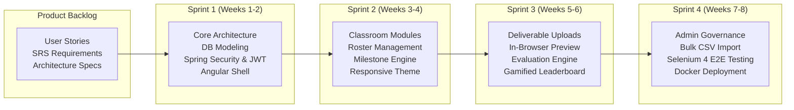

### 3.1 Sprint Breakdown
- **Sprint 1 (Foundation & Security)**: Domain entity modeling (JPA), relational schema definition, Spring Security 6 with stateless JWT authentication, and Angular 18 standalone component architecture.
- **Sprint 2 (Course & Milestone Authoring)**: Faculty classroom creation, student batch assignment, milestone deadline scheduling, and responsive card carousel components.
- **Sprint 3 (Submissions, Previews & Gamification)**: Multipart file upload pipeline, in-browser PDF/DOCX rendering, instructor evaluation modal, and real-time leaderboard ranking algorithm.
- **Sprint 4 (Governance, E2E Testing & Hardening)**: Bulk CSV user import with error-handling modal, soft-delete reactivation, system audit trails, Selenium 4 Page Object Model test harness (14 E2E tests), and Docker containerization.

---

# 📊 4. Structured Systems Analysis & Design (SSAD)

## 4.1 DFD Level 0 — Context Diagram
The Level 0 Data Flow Diagram delineates the boundary of the EduTrack system, highlighting inputs and outputs across primary external entities:

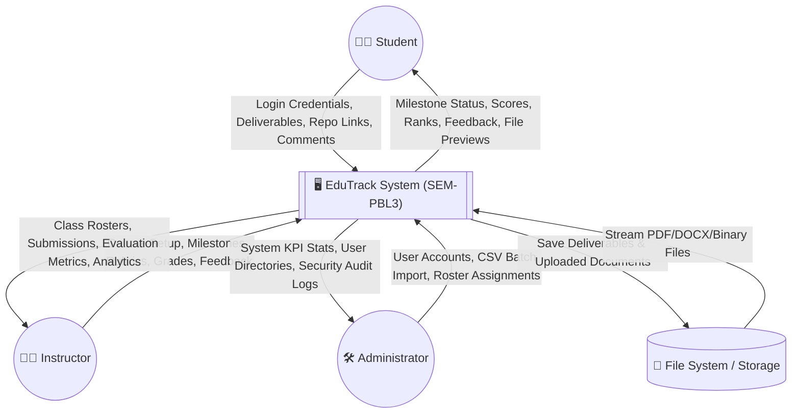

---

## 4.2 DFD Level 1 — Detailed Subsystem Data Flow

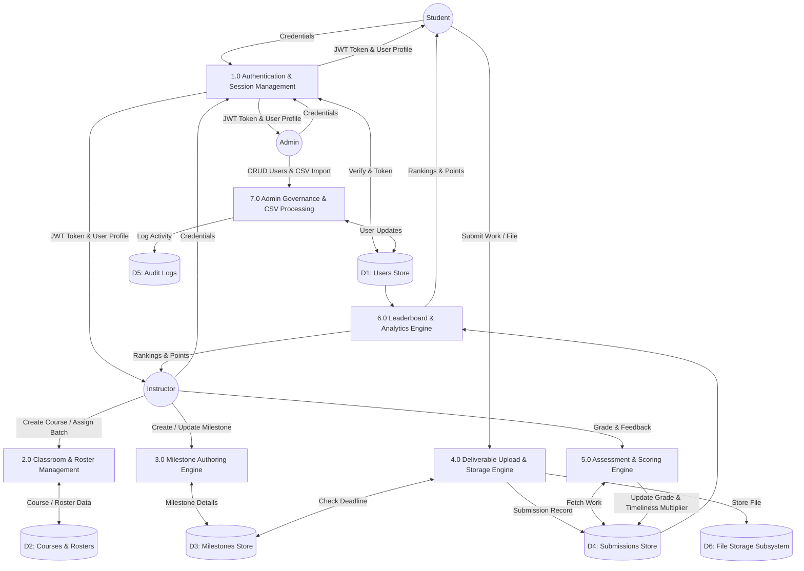

---

## 4.3 Entity-Relationship Diagram (ERD)

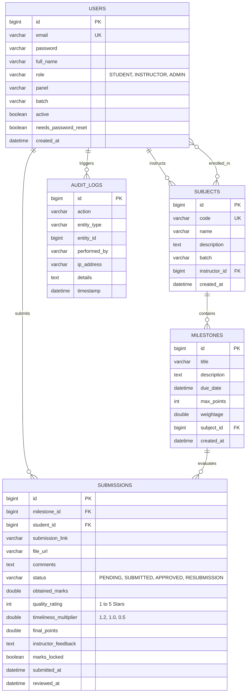

---

## 4.4 Data Dictionary

| Table Name | Attribute | Type | Constraints | Description |
|---|---|---|---|---|
| `users` | `id` | `BIGINT` | `PK`, Auto-Increment | Unique user identifier |
| | `email` | `VARCHAR(120)` | `NOT NULL`, `UNIQUE` | Institutional email address for login |
| | `role` | `VARCHAR(20)` | `NOT NULL` | Role enum: `STUDENT`, `INSTRUCTOR`, `ADMIN` |
| | `panel` / `batch` | `VARCHAR(10)` | Nullable | Academic panel (A/B/C) and sub-batch (A1, A2) |
| | `active` | `BOOLEAN` | `DEFAULT TRUE` | Soft-delete flag preserving historical integrity |
| `subjects` | `id` | `BIGINT` | `PK`, Auto-Increment | Unique course ID |
| | `code` | `VARCHAR(30)` | `NOT NULL`, `UNIQUE` | Course code (e.g. `CSE20140-PBL3`) |
| | `instructor_id` | `BIGINT` | `FK` $\rightarrow$ `users(id)` | Assigned faculty coordinator |
| `milestones` | `id` | `BIGINT` | `PK`, Auto-Increment | Unique milestone ID |
| | `due_date` | `DATETIME` | `NOT NULL` | Deadline used for timeliness multiplier calculation |
| | `max_points` | `INT` | `NOT NULL` | Base point capacity for assignment |
| `submissions`| `id` | `BIGINT` | `PK`, Auto-Increment | Unique submission ID |
| | `timeliness_multiplier`| `DOUBLE` | `DEFAULT 1.0` | Multiplier: $1.2\times$ (Early), $1.0\times$ (On-Time), $0.5\times$ (Late) |
| | `quality_rating` | `INT` | Range: `1` to `5` | Faculty rubric star rating |
| | `final_points` | `DOUBLE` | Computed | $\text{Base Points} \times \text{Multiplier} \times \frac{\text{Rating}}{5}$ |
| | `marks_locked` | `BOOLEAN` | `DEFAULT FALSE` | Prevents post-approval grade tampering |

---

# 🧩 5. Object-Oriented Analysis & Design (OOAD)

## 5.1 Use Case Diagram

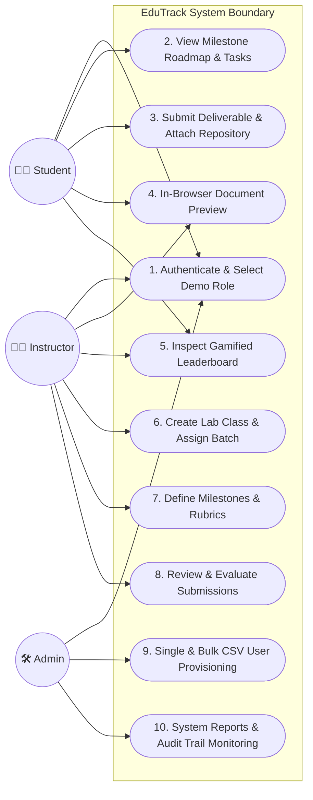

---

## 5.2 System Class Diagram

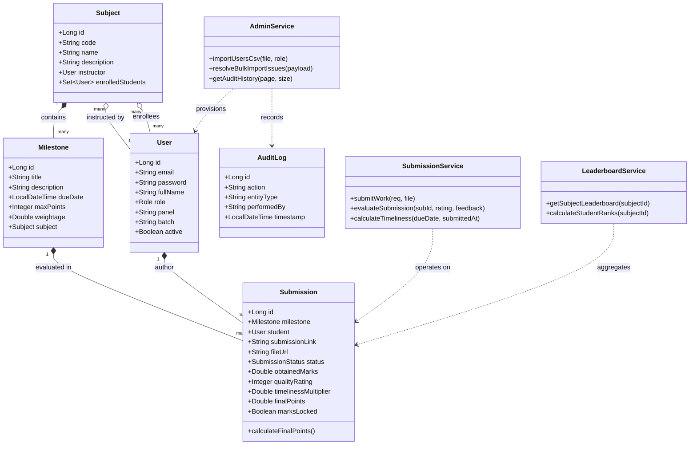

---

## 5.3 Sequence Diagrams

### Sequence Diagram 1: Student Deliverable Submission & Timeliness Calculation
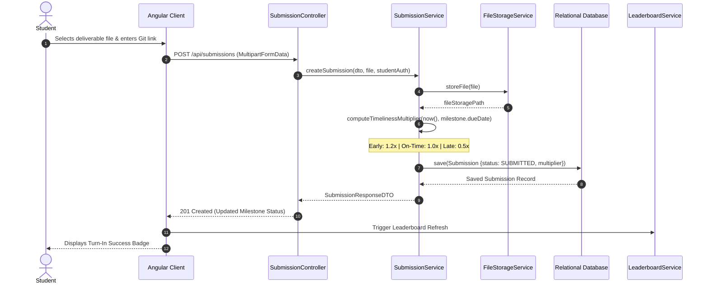

### Sequence Diagram 2: Bulk CSV User Provisioning & Issue Resolution
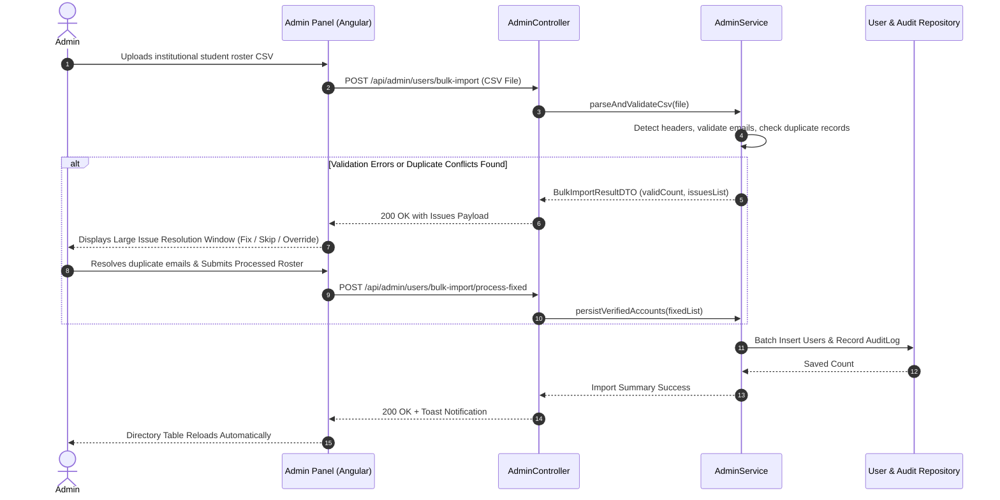

---

## 5.4 Submission Lifecycle State Machine

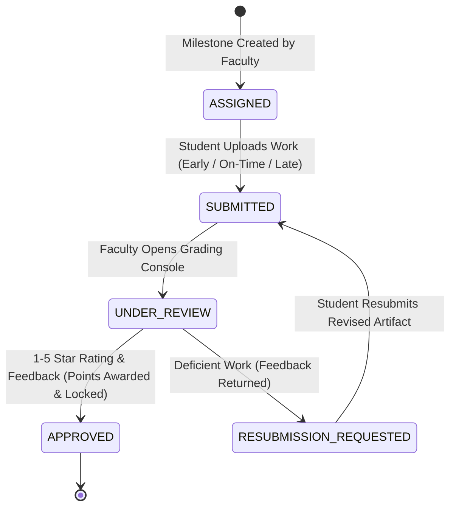

---

# 📐 6. Software Cost Estimation & Metrics

All estimations are grounded in the physical source inventory of the EduTrack codebase (**109 source files, 21,995 physical lines of code, ~15.2 KSLOC**).

## 6.1 Function Point Analysis (FPA - IFPUG Standard)

### Step 1: Unadjusted Function Points (UFP)
Calculated across the five standard information domain functions:

| Information Domain Function | Low | Average | High | Total FP |
|---|:---:|:---:|:---:|:---:|
| **Internal Logical Files (ILF)** | $3 \times 7 = 21$ | $2 \times 10 = 20$ | 0 | **41** |
| **External Interface Files (EIF)**| $2 \times 5 = 10$ | 0 | 0 | **10** |
| **External Inputs (EI)** | $4 \times 3 = 12$ | $4 \times 4 = 16$ | $1 \times 6 = 6$ | **34** |
| **External Outputs (EO)** | 0 | $3 \times 5 = 15$ | $1 \times 7 = 7$ | **22** |
| **External Inquiries (EQ)** | $4 \times 3 = 12$ | $1 \times 4 = 4$ | 0 | **16** |
| **Unadjusted Function Points (UFP)** | | | | **123** |

### Step 2: Value Adjustment Factor (VAF)
Evaluated using the 14 General System Characteristics (GSC, total degree of influence $\sum F_i = 48$):
$$VAF = 0.65 + \left(0.01 \times \sum_{i=1}^{14} F_i\right) = 0.65 + (0.01 \times 48) = \mathbf{1.13}$$

### Step 3: Adjusted Function Points (AFP)
$$AFP = UFP \times VAF = 123 \times 1.13 = \mathbf{138.99 \approx 139 \text{ AFP}}$$

---

## 6.2 COCOMO II (Post-Architecture Model)

### Step 1: Sizing Parameter
- **$Size$** = **$15.2 \text{ KSLOC}$** (4.3k Java Backend + 8.0k TypeScript Frontend + 2.9k HTML Templates).

### Step 2: Scale Factors ($SF$) & Exponent $E$
$$E = B + 0.01 \times \sum_{j=1}^5 SF_j \quad (B = 0.91)$$
- Precedentedness (PREC): Nominal (3.72)
- Development Flexibility (FLEX): High (2.03)
- Architecture / Risk Resolution (RESL): High (2.83)
- Team Cohesion (TEAM): High (2.19)
- Process Maturity (PMAT): Nominal (4.68)
$$\sum SF_j = 15.45 \implies E = 0.91 + (0.01 \times 15.45) = \mathbf{1.0645}$$

### Step 3: Effort Multipliers Product ($\prod EM_i$)
Evaluating the 17 Cost Drivers (high programmer capability $0.88$, high analyst capability $0.85$, modern tool usage $0.90$, low platform volatility $0.87$, co-located team $0.90$):
$$\prod_{i=1}^{17} EM_i \approx \mathbf{0.432}$$

### Step 4: Effort Calculation (Person-Months)
$$PM = A \times (Size)^E \times \prod EM_i = 2.94 \times (15.2)^{1.0645} \times 0.432$$
$$(15.2)^{1.0645} \approx 18.116$$
$$PM_{\text{nominal}} = 2.94 \times 18.116 = 53.26 \text{ Person-Months}$$
$$PM_{\text{adjusted}} = 53.26 \times 0.432 = \mathbf{23.01 \text{ Person-Months}}$$

### Step 5: Schedule ($TDEV$) & Staffing
$$F = 0.28 + 0.2 \times (1.0645 - 0.91) = \mathbf{0.3109}$$
$$TDEV = 3.67 \times (PM)^F = 3.67 \times (23.01)^{0.3109} = \mathbf{9.73 \text{ Calendar Months}}$$

$$\text{Nominal Average Staff} = \frac{PM}{TDEV} = \frac{23.01}{9.73} \approx \mathbf{2.36 \text{ Engineers}}$$
$$\text{Semester Project Delivery Team (4 Core Engineers)}: \frac{23.01 \text{ PM}}{4 \text{ Months}} \approx \mathbf{5.75 \text{ Effort Equiv. (Parallel Multitasking Execution)}}$$

| Team Member | Engineering Role | Key Modules & Contributions |
|---|---|---|
| **Anurag Harapanahalli** | Fullstack Lead & System Architect | Spring Boot core, Security/JWT, Angular shell, Selenium POM automation harness |
| **Aaryan Kumbhare** | Backend & Database Engineer | Relational JPA schema, REST endpoints, Timeliness algorithm & Leaderboard service |
| **Harshad Pardhi** | Frontend UI/UX Engineer | Angular standalone components, Netflix-style roadmap carousel, Document preview |
| **Nayna Sharma** | QA & Systems Governance Engineer | E2E test scenarios, Admin governance module, CSV parser validation, Technical documentation |

---

## 6.3 Critical Path Method (CPM)

### Work Breakdown Structure (WBS) & Schedule Network

| Task | Description | Predecessors | Duration ($D$) | ES | EF | LS | LF | Total Float | Critical? |
|:---:|---|:---:|:---:|:---:|:---:|:---:|:---:|:---:|:---:|
| **A** | Requirements Elicitation & SRS | None | 5 | 0 | 5 | 0 | 5 | **0** | **YES** |
| **B** | Database Schema & ER Design | A | 4 | 5 | 9 | 5 | 9 | **0** | **YES** |
| **C** | UI/UX Wireframing & Design System | A | 4 | 5 | 9 | 6 | 10 | **1** | No |
| **D** | Core Backend & JWT Security Setup | B | 6 | 9 | 15 | 9 | 15 | **0** | **YES** |
| **E** | Frontend Angular Foundation Shell | C | 5 | 9 | 14 | 10 | 15 | **1** | No |
| **F** | Admin Governance & Bulk CSV Module | D, E | 7 | 15 | 22 | 34 | 41 | **19** | No |
| **G** | Course & Classroom Management | D, E | 6 | 15 | 21 | 15 | 21 | **0** | **YES** |
| **H** | Assignment & Milestone Engine | G | 8 | 21 | 29 | 21 | 29 | **0** | **YES** |
| **I** | Deliverable Upload & Storage Subsystem | H | 7 | 29 | 36 | 29 | 36 | **0** | **YES** |
| **J** | Gamified Leaderboard & Ranks Engine | I | 5 | 36 | 41 | 36 | 41 | **0** | **YES** |
| **K** | Selenium 4 E2E Automation Test Suite | F, J | 5 | 41 | 46 | 41 | 46 | **0** | **YES** |
| **L** | Final Integration, Hardening & Deploy | K | 4 | 46 | 50 | 46 | 50 | **0** | **YES** |

### Critical Path Identification:
$$\mathbf{A \longrightarrow B \longrightarrow D \longrightarrow G \longrightarrow H \longrightarrow I \longrightarrow J \longrightarrow K \longrightarrow L}$$
$$\text{Total Project Duration} = 5 + 4 + 6 + 6 + 8 + 7 + 5 + 5 + 4 = \mathbf{50 \text{ Working Days (10 Weeks)}}$$

---

## 6.4 PERT (Program Evaluation & Review Technique) Analysis

PERT utilizes a three-point probabilistic duration model:
$$T_e = \frac{o + 4m + p}{6}, \quad \sigma^2 = \left(\frac{p - o}{6}\right)^2$$
*(where $o = \text{optimistic}$, $m = \text{most likely}$, $p = \text{pessimistic}$)*

| Task | Optimistic ($o$) | Most Likely ($m$) | Pessimistic ($p$) | Expected Time ($T_e$) | Variance ($\sigma^2$) | On Critical Path? |
|:---:|:---:|:---:|:---:|:---:|:---:|:---:|
| **A** | 4 | 5 | 6 | 5.00 | 0.111 | **Yes** |
| **B** | 3 | 4 | 5 | 4.00 | 0.111 | **Yes** |
| **C** | 3 | 4 | 5 | 4.00 | 0.111 | No |
| **D** | 5 | 6 | 7 | 6.00 | 0.111 | **Yes** |
| **E** | 4 | 5 | 6 | 5.00 | 0.111 | No |
| **F** | 5 | 7 | 9 | 7.00 | 0.444 | No |
| **G** | 5 | 6 | 7 | 6.00 | 0.111 | **Yes** |
| **H** | 6 | 8 | 10 | 8.00 | 0.444 | **Yes** |
| **I** | 5 | 7 | 9 | 7.00 | 0.444 | **Yes** |
| **J** | 4 | 5 | 6 | 5.00 | 0.111 | **Yes** |
| **K** | 4 | 5 | 6 | 5.00 | 0.111 | **Yes** |
| **L** | 3 | 4 | 5 | 4.00 | 0.111 | **Yes** |

### Variance Along Critical Path:
$$\sigma_{CP}^2 = 0.111 + 0.111 + 0.111 + 0.111 + 0.444 + 0.444 + 0.111 + 0.111 + 0.111 = \mathbf{1.565}$$
$$\sigma_{CP} = \sqrt{1.565} = \mathbf{1.251 \text{ days}}$$

### Probability of Completion within 52 Days:
$$Z = \frac{T_d - T_e}{\sigma_{CP}} = \frac{52 - 50}{1.251} = \frac{2}{1.251} \approx \mathbf{1.60}$$
From standard normal distribution tables:
$$P(Z \le 1.60) = \mathbf{94.52\%}$$
> The team possesses a **94.5% statistical confidence** of completing the project within 52 calendar working days.

---

# 🧪 7. Quality Assurance & Selenium 4 Automated Testing

EduTrack incorporates an end-to-end (E2E) automated browser testing harness powered by **Selenium 4.26** and **JUnit 5**, strictly structured around the industry-standard **Page Object Model (POM)** pattern.

## 7.1 Page Object Model (POM) Architecture

The POM decoupling strategy isolates test assertion logic from UI document object model (DOM) locators:

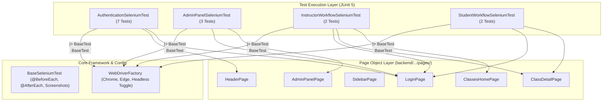

---

## 7.2 Automated E2E Test Suite Matrix

**Execution Summary: 14 Tests Executed, 0 Failures, 0 Errors, 0 Skipped (100% Pass Rate).**

| Test Class | Test Case Method | Description & Verification Steps | Result |
|---|---|---|:---:|
| **`AuthenticationSeleniumTest`** | `testStudentDemoLogin()` | Clicks "Student Demo" button; verifies redirection to student dashboard and student role badge. | ✅ **PASS** |
| | `testInstructorDemoLogin()` | Clicks "Faculty Demo" button; verifies instructor header card and "Create Class" action visibility. | ✅ **PASS** |
| | `testAdminDemoLogin()` | Clicks "Admin Demo" button; verifies admin governance navigation tabs and KPI widgets. | ✅ **PASS** |
| | `testManualValidLogin()` | Enters manual credentials `anurag@edutrack.edu`; verifies successful session and token issuance. | ✅ **PASS** |
| | `testInvalidCredentialsShowsError()` | Inputs incorrect password; verifies `.gc-auth-error` banner displays "Invalid credentials". | ✅ **PASS** |
| | `testThemeToggle()` | Toggles theme mode; verifies `data-theme="dark"` attribute flips on document body. | ✅ **PASS** |
| | `testLogoutFlow()` | Opens profile dropdown and clicks logout; verifies return to login screen and session clearing. | ✅ **PASS** |
| **`AdminPanelSeleniumTest`** | `testAdminNavigationAndTabs()` | Cycles through User Accounts, Lab Classes, Audit History, and System Reports tabs cleanly. | ✅ **PASS** |
| | `testAdminCreatesNewStudent()` | Opens Create User modal, fills details (`STUDENT`, Panel A, Batch A1), saves, and verifies table presence. | ✅ **PASS** |
| | `testAdminSearchUserFilter()` | Types user email in search box; verifies dynamic table row filtering. | ✅ **PASS** |
| **`InstructorWorkflowSeleniumTest`** | `testInstructorCreatesNewClass()` | Opens Create Class modal, inputs class name, code, description, and batch; verifies card in grid. | ✅ **PASS** |
| | `testInstructorNavigatesClassTabs()`| Enters class; switches between Stream, Classwork, People, and Leaderboard tabs smoothly. | ✅ **PASS** |
| **`StudentWorkflowSeleniumTest`** | `testStudentViewsClassworkAndMilestones()` | Student logs in; verifies assignment milestones and timeline progress cards appear. | ✅ **PASS** |
| | `testStudentViewsLeaderboardTab()` | Inspects leaderboard tab; verifies student rankings, point tallies, and badges render. | ✅ **PASS** |

---

## 7.3 Running the Automated Tests

> **Prerequisite**: Ensure the Spring Boot backend (`http://localhost:8080`) and Angular frontend (`http://localhost:4200`) are active.

### Run All Selenium Tests Headless (Default)
```powershell
mvn -f backend/pom.xml test "-Dtest=*SeleniumTest" "-DbaseUrl=http://localhost:4200" "-Dheadless=true"
```

### Run Tests in Visual Mode (Live Browser Window)
```powershell
mvn -f backend/pom.xml test "-Dtest=*SeleniumTest" "-DbaseUrl=http://localhost:4200" "-Dheadless=false"
```

### Run a Targeted Suite Visually
```powershell
mvn -f backend/pom.xml test "-Dtest=AuthenticationSeleniumTest" "-DbaseUrl=http://localhost:4200" "-Dheadless=false"
```

---

# 💻 8. System Architecture & Technology Stack

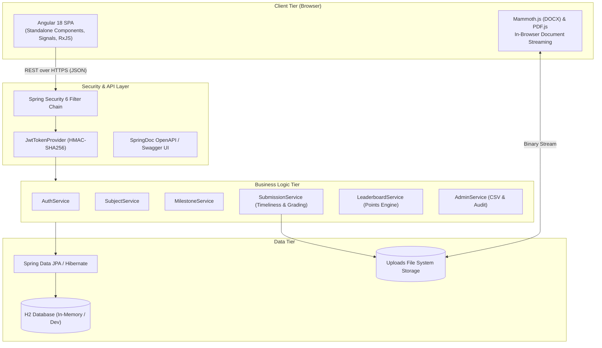

| Layer | Technology | Version | Purpose |
|---|---|:---:|---|
| **Frontend Framework** | Angular | 18 / 19 | Reactive SPA architecture with Standalone Components & Signals |
| **Language (Frontend)** | TypeScript | 5.4 | Type-safe enterprise client application engineering |
| **Document Rendering** | Mammoth.js / PDF.js | Latest | In-browser parsing of `.docx` and `.pdf` deliverables |
| **Backend Framework** | Spring Boot | 3.2.0 | Micro-modular RESTful API backend platform |
| **Security & Auth** | Spring Security / JJWT | 0.11.5 | Stateless JWT authentication, role guards, password hashing |
| **Database & ORM** | Spring Data JPA / Hibernate | 6.x | Relational mapping, query abstraction, automated DDL |
| **Relational DB** | H2 Database / PostgreSQL | - | In-memory dev runtime with seamless production RDBMS portability |
| **Automated Testing** | Selenium 4 / JUnit 5 | 4.26.0 | End-to-end browser automation with automated failure screenshots |
| **API Documentation** | SpringDoc OpenAPI | 2.2.0 | Interactive Swagger documentation for all REST endpoints |

---

# ⚙️ 9. Installation, Setup & Execution Guide

### 📋 Prerequisites
- **Java Development Kit (JDK)**: Version 17 LTS or higher (`java -version`)
- **Node.js**: Version 18.x or 20.x LTS (`node -v`)
- **npm**: Version 9.x or higher (`npm -v`)
- **Maven**: Version 3.8+ (or use IDE bundled Maven)
- **Web Browser**: Google Chrome or Microsoft Edge

---

### Step 1: Start the Backend REST Server
Open a terminal in the project root:
```bash
cd backend
mvn spring-boot:run
```
- **Backend API**: Accessible at `http://localhost:8080`
- **Swagger UI Interactive Documentation**: [http://localhost:8080/swagger-ui/index.html](http://localhost:8080/swagger-ui/index.html)
- **H2 Database Console**: [http://localhost:8080/h2-console](http://localhost:8080/h2-console)  
  *(JDBC URL: `jdbc:h2:mem:edutrackdb`, Username: `sa`, Password: leave blank)*

---

### Step 2: Start the Angular Frontend Application
Open a second terminal window:
```bash
cd frontend-angular
npm install
npm start
```
- **Web Client Application**: Open your browser to `http://localhost:4200`

---

### Step 3: Default Demo Accounts

The database initializes with comprehensive demo data. You can click the one-click demo login buttons or enter:

| Role | Email | Password | Primary Accessible Functions |
|---|---|---|---|
| 👨‍🎓 **Student** | `anurag@edutrack.edu` | `student123` | View milestones, submit files/links, view leaderboard rank |
| 👨‍🏫 **Faculty** | `sharma@edutrack.edu` | `prof123` | Create classrooms, define assignments, evaluate with 1-5 stars |
| 🛠️ **Administrator** | `admin@edutrack.edu` | `admin123` | Provision accounts, bulk import CSVs, audit system activity |

---

# 📁 10. Repository Structure

```
SEM-PBL3/
├── backend/                                   # Java Spring Boot 3 REST API Server
│   ├── pom.xml                                # Maven POM (Spring Boot, Security, Selenium, JUnit)
│   └── src/
│       ├── main/java/com/edutrack/
│       │   ├── config/                        # SecurityConfig, JwtTokenProvider, DataInitializer
│       │   ├── controller/                    # Auth, Subject, Milestone, Submission, Admin Controllers
│       │   ├── dto/                           # Request & Response Transfer Objects
│       │   ├── exception/                     # GlobalExceptionHandler
│       │   ├── model/                         # User, Subject, Milestone, Submission, AuditLog Entities
│       │   ├── repository/                    # Spring Data JPA Repositories
│       │   └── service/                       # Business Logic, Points Algorithm, FileStorage
│       └── test/java/com/edutrack/selenium/   # Automated E2E Testing Harness
│           ├── config/                        # BaseSeleniumTest, WebDriverFactory
│           ├── pages/                         # Page Object Model classes (LoginPage, AdminPanelPage, etc.)
│           └── tests/                         # E2E Test Suites (Auth, Admin, Instructor, Student)
│
├── frontend-angular/                          # Angular 18 Single-Page Application
│   ├── package.json                           # NPM dependencies (Angular, Mammoth, FontAwesome)
│   ├── angular.json                           # Angular build & serve configuration
│   └── src/
│       ├── app/
│       │   ├── components/                    # Modular feature components
│       │   │   ├── admin-panel/               # Admin dashboard, user table, CSV issue resolution
│       │   │   ├── auth/                      # Login & demo credentials interface
│       │   │   ├── class-detail/              # Stream, Classwork, People, Leaderboard tabs
│       │   │   ├── classes-home/              # Instructor & Student classroom card grid
│       │   │   └── modals/                    # Modals: Create Class, Milestone, Upload, DOCX Preview
│       │   ├── models/                        # TypeScript interfaces & DTO contracts
│       │   ├── services/                      # ApiService, AuthService, ViewStateService
│       │   ├── app.html                       # Master SPA shell layout
│       │   └── app.ts                         # Application root component
│       ├── styles.css                         # Dark/Light theme system & glassmorphism variables
│       └── index.html                         # SPA Entry HTML
│
├── uploads/                                   # Local storage for student deliverable files
├── PROJECT_METRICS_CALCULATION.md             # In-depth FPA, COCOMO II, and CPM calculations
└── README.md                                  # Comprehensive Project Dossier & Writeup
```

---

### 🏆 Academic Credits & Project Declaration
- **Course**: Project-Based Learning III (CSE20140)
- **Degree**: Bachelor of Technology in Computer Science & Engineering
- **Platform**: EduTrack Enterprise Platform

#### 👥 Project Team:
| Full Name | Role | Responsibilities |
|---|---|---|
| **Anurag Harapanahalli** | Fullstack Lead & System Architect | Spring Boot Architecture, Security/JWT, Selenium E2E Automation, Angular Integration |
| **Aaryan Kumbhare** | Backend & Database Systems Engineer | Relational JPA Modeling, REST Controllers, Gamification & Leaderboard Points Logic |
| **Harshad Pardhi** | Frontend UI/UX Engineer | Standalone Components, Glassmorphic Styling, Horizontal Milestone Carousels, File Previews |
| **Nayna Sharma** | QA & Systems Governance Engineer | End-to-End Test Design, Admin Governance Subsystem, CSV Data Ingestion, Documentation |

*Submitted in partial fulfillment of the requirements for Project-Based Learning III (SEM-PBL3).*
